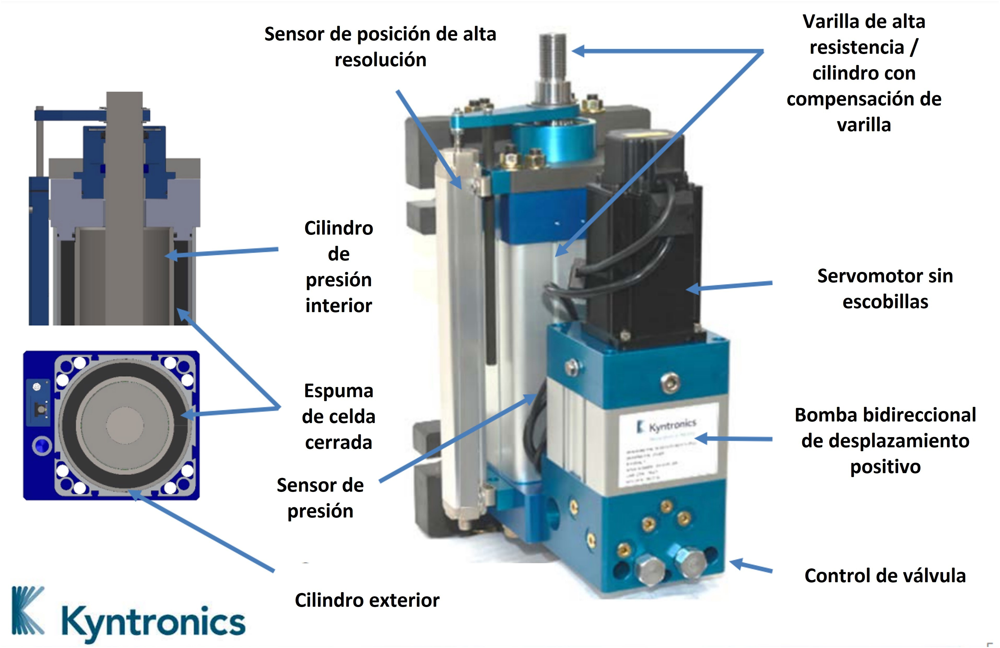

> Los actuadores son componentes esenciales en sistemas de control y automatización. En esta tarea se describen los tipos de actuadores más comunes.

## Actuadores Eléctricos: Convirtiendo Electricidad en Movimiento

Los actuadores eléctricos son dispositivos que transforman la energía eléctrica en movimiento mecánico, ya sea lineal o rotativo. Son ampliamente utilizados en diversas aplicaciones industriales, comerciales y domésticas debido a su precisión, control y facilidad de integración con sistemas automatizados.

### Tipos de Actuadores Eléctricos

**Actuadores Lineales**

> Estos actuadores producen un movimiento en línea recta. Pueden ser:

| Tipo de Actuador       | Descripción                                                                 |
|------------------------|-----------------------------------------------------------------------------|
| Cilindros Eléctricos   | Utilizan un motor eléctrico para impulsar un pistón que se desplaza dentro de un cilindro. |
| Actuadores de Husillo  | Convierten el movimiento rotativo de un motor en movimiento lineal mediante un husillo roscado. |
| Actuadores de Correa   | Utilizan un motor eléctrico para mover una correa que transmite el movimiento a una carga. |  

----

**Actuadores Rotativos**

> Producen un movimiento giratorio. Los más comunes son:

| Tipo de Actuador       | Descripción                                                                 |
|------------------------|-----------------------------------------------------------------------------|
| Motores Eléctricos     | Convierten la energía eléctrica directamente en movimiento rotativo. Pueden ser de corriente continua (DC) o alterna (AC), y de diferentes tipos (síncronos, asíncronos, paso a paso). |
| Servomotores           | Motores DC o AC con control de posición preciso mediante retroalimentación. |

### Funcionamiento

El principio de funcionamiento de un actuador eléctrico depende de su tipo:

| Tipo de Actuador       | Descripción                                                                 |
|------------------------|-----------------------------------------------------------------------------|
| Cilindros Eléctricos   | El motor eléctrico acciona un mecanismo de tornillo o correa que mueve el pistón dentro del cilindro. |
| Actuadores de Husillo  | El motor eléctrico gira un husillo roscado, convirtiendo el movimiento rotativo en lineal a medida que una tuerca se desplaza a lo largo del husillo. |
| Actuadores de Correa   | El motor eléctrico mueve una correa dentada que transmite el movimiento a una carga lineal. |
| Motores Eléctricos     | La interacción entre campos magnéticos generados por bobinas y imanes produce un par motor que hace girar el rotor. |
| Servomotores           | Además del motor, incorporan un encoder o resolver para medir la posición del eje y un controlador que ajusta la corriente del motor para alcanzar la posición deseada. |

### Características

| Característica         | Descripción                                                                 |
|------------------------|-----------------------------------------------------------------------------|
| Fuerza o Torque        | Capacidad del actuador para generar fuerza lineal o torque rotativo.        |
| Velocidad              | Velocidad de desplazamiento lineal o angular del actuador.                  |
| Precisión              | Capacidad del actuador para alcanzar y mantener una posición específica.    |
| Carrera o Ángulo de Giro | Distancia máxima de desplazamiento lineal o ángulo máximo de rotación.     |
| Eficiencia             | Relación entre la energía eléctrica consumida y la energía mecánica producida. |
| Vida Útil              | Número de ciclos de operación que el actuador puede realizar antes de fallar. |

### Modos de Comunicación

| Modo de Comunicación | Descripción                                                                 |
|----------------------|-----------------------------------------------------------------------------|
| Analógica            | Señales de voltaje o corriente analógicas para controlar la velocidad o posición del actuador. |
| Digital              | Señales digitales (pulsos) para controlar motores paso a paso o servomotores. |
| Buses de Campo       | Protocolos de comunicación industrial como CANbus, Profibus o Ethernet/IP para control y monitoreo avanzado. |

## Actuadores Mecánicos: Transformando Energía en Movimiento

Los actuadores mecánicos son dispositivos que convierten diferentes formas de energía (manual, neumática, hidráulica, etc.) en movimiento mecánico, principalmente lineal o rotativo. A diferencia de los actuadores eléctricos, que utilizan motores eléctricos, los actuadores mecánicos se basan en principios mecánicos como engranajes, levas, tornillos y resortes para generar movimiento.

### Tipos de Actuadores Mecánicos

#### Actuadores Lineales

| Mecanismo              | Descripción                                                                 |
|------------------------|-----------------------------------------------------------------------------|
| Husillos               | Un tornillo roscado convierte el movimiento rotativo en lineal.              |
| Cremalleras y Piñones  | Un piñón engrana con una cremallera para producir movimiento lineal.         |
| Cintas y Poleas        | Una cinta flexible transmite el movimiento entre poleas.                    |
| Levas                  | Una leva con perfil especial convierte el movimiento rotativo en lineal complejo. |
| Resortes               | Almacenan energía mecánica y la liberan para producir movimiento.            |

#### Actuadores Rotativos:

| Mecanismo              | Descripción                                                                 |
|------------------------|-----------------------------------------------------------------------------|
| Engranajes             | Ruedas dentadas transmiten y modifican el movimiento rotativo.               |
| Levas                  | Convierten el movimiento rotativo en movimiento oscilante o lineal complejo. |
| Trinquetes y Ruedas Libres | Permiten el movimiento en una sola dirección.                             |

### Funcionamiento

El principio de funcionamiento de un actuador mecánico depende de su tipo específico. En general, se basan en la transformación de un tipo de movimiento en otro mediante elementos mecánicos:

| Mecanismo              | Descripción                                                                 |
|------------------------|-----------------------------------------------------------------------------|
| Husillos               | El giro del tornillo provoca el avance o retroceso de una tuerca a lo largo de su rosca. |
| Cremalleras y Piñones  | El giro del piñón se traduce en movimiento lineal de la cremallera.         |
| Cintas y Poleas        | La rotación de una polea se transmite a otra mediante una cinta, generando movimiento lineal o rotativo en la segunda polea. |
| Levas                  | El perfil de la leva determina el movimiento del seguidor en función de la rotación de la leva. |
| Resortes               | Acumulan energía al ser comprimidos o estirados, y la liberan para generar movimiento. |
| Engranajes             | La relación entre el número de dientes de los engranajes determina la relación de transmisión y la modificación del movimiento rotativo. |

### Características

| Característica         | Descripción                                                                 |
|------------------------|-----------------------------------------------------------------------------|
| Fuerza o Torque        | Capacidad del actuador para generar fuerza lineal o torque rotativo.        |
| Velocidad              | Velocidad de desplazamiento lineal o angular del actuador.                  |
| Precisión              | Capacidad del actuador para alcanzar y mantener una posición específica (puede ser limitada en algunos tipos). |
| Carrera o Ángulo de Giro | Distancia máxima de desplazamiento lineal o ángulo máximo de rotación.     |
| Eficiencia             | Relación entre la energía de entrada y la energía mecánica de salida.       |
| Simplicidad y Robustez | Generalmente, los actuadores mecánicos son simples y robustos, ideales para entornos exigentes. |

### Modo de Comunicación

⚠️ Generalmente, no tienen comunicación directa. Los actuadores mecánicos suelen ser controlados por otros sistemas (neumáticos, hidráulicos, eléctricos) que sí pueden tener comunicación.

## Actuadores Hidráulicos: Potencia en Movimiento

Los actuadores hidráulicos son dispositivos que utilizan la presión de un fluido, generalmente aceite, para generar movimiento mecánico, principalmente lineal o rotativo. Son conocidos por su alta potencia, precisión y capacidad para manejar cargas pesadas, lo que los hace ideales para aplicaciones industriales y maquinaria pesada.

### Tipos de Actuadores Hidráulicos

#### Cilindros Hidráulicos:

| Tipo de Cilindro          | Descripción                                                                 |
|---------------------------|-----------------------------------------------------------------------------|
| Cilindros de Simple Efecto | La presión del fluido solo actúa en una dirección, el retorno se realiza mediante un resorte o la gravedad. |
| Cilindros de Doble Efecto  | La presión del fluido actúa en ambas direcciones, permitiendo un control preciso del movimiento en ambos sentidos. |

#### Motores Hidráulicos:

| Tipo de Motor         | Descripción                                                                 |
|-----------------------|-----------------------------------------------------------------------------|
| Motores de Engranajes | El fluido a presión impulsa engranajes internos, generando movimiento rotativo. |
| Motores de Paletas    | El fluido a presión empuja paletas deslizantes dentro de un rotor, produciendo rotación. |
| Motores de Pistones   | El fluido a presión actúa sobre pistones dispuestos radial o axialmente, generando movimiento rotativo. |

### Funcionamiento

El principio básico de funcionamiento de un actuador hidráulico es el siguiente:

| Proceso               | Descripción                                                                 |
|-----------------------|-----------------------------------------------------------------------------|
| Generación de Presión | Una bomba hidráulica presuriza el fluido (aceite).                           |
| Control de Flujo      | Válvulas direccionales controlan la dirección y el caudal del fluido hacia el actuador. |
| Actuación             | El fluido a presión entra en una cámara del actuador, ejerciendo fuerza sobre un pistón o conjunto de paletas/pistones. |
| Movimiento Mecánico   | La fuerza ejercida por el fluido se traduce en movimiento lineal (cilindros) o rotativo (motores). |

### Características

| Característica         | Descripción                                                                 |
|------------------------|-----------------------------------------------------------------------------|
| Alta Potencia          | Pueden generar fuerzas y torques muy elevados.                              |
| Precisión              | Permiten un control preciso del movimiento y la posición.                   |
| Robustez y Durabilidad | Son resistentes a condiciones de trabajo exigentes.                         |
| Compacidad             | Alta relación potencia/tamaño.                                              |
| Mantenimiento          | Requieren mantenimiento periódico del sistema hidráulico (filtros, aceite, etc.). |

### Modo de Comunicación

💔 Generalmente, no tienen comunicación directa. Los actuadores hidráulicos suelen ser controlados por válvulas direccionales que a su vez son accionadas eléctricamente o manualmente.