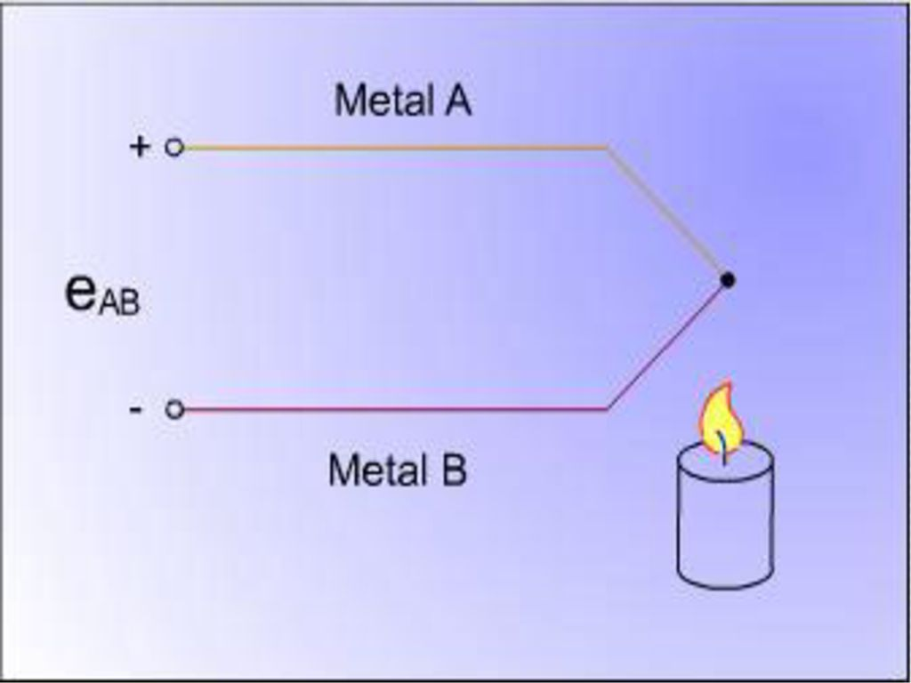
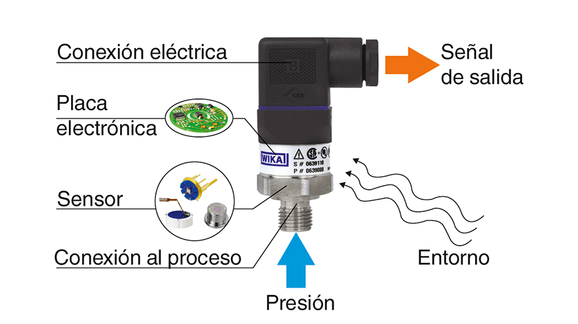
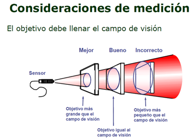

# Tipos de Sensores

## Sensores Ópticos

Los sensores ópticos son dispositivos que detectan la luz u otras formas de radiación electromagnética y convierten esta información en una señal eléctrica. Son ampliamente utilizados en diversas aplicaciones, desde la industria hasta la electrónica de consumo, gracias a su precisión, velocidad y versatilidad.

### Tipo

| **Tipo de Sensor**            | **Descripción**                                                                                                                                          |
|-------------------------------|----------------------------------------------------------------------------------------------------------------------------------------------------------|
| Sensores Fotoeléctricos       | Detectan la presencia o ausencia de un objeto mediante la interrupción o reflexión de un haz de luz. Incluyen sensores de barrera, reflectivos y de proximidad. |
| Sensores de Fibra Óptica      | Utilizan fibras ópticas para transmitir y recibir luz, lo que les permite operar en entornos hostiles o de difícil acceso. Son ideales para aplicaciones de alta temperatura, alta presión o alta vibración. |
| Fotodiodos y Fototransistores | Convierten la luz directamente en una corriente eléctrica. Los fotodiodos son más rápidos y precisos, mientras que los fototransistores son más sensibles. |
| Sensores de Imagen            | Capturan imágenes bidimensionales de una escena. Se utilizan en cámaras digitales, teléfonos móviles y sistemas de visión artificial.                     |
| Sensores de Luz Ambiental     | Miden la intensidad de la luz ambiental. Se utilizan en pantallas de dispositivos electrónicos para ajustar el brillo automáticamente.                      |

### Funcionamiento

El principio básico de funcionamiento de un sensor óptico es la conversión de la luz en una señal eléctrica. Esto se logra mediante diferentes mecanismos, dependiendo del tipo de sensor:

| **Mecanismo**                | **Descripción** |
|------------------------------|----------------------------------------------------------------------------------------------------------------------|
| Efecto Fotoeléctrico         | Los fotones incidentes liberan electrones en un material semiconductor, generando una corriente eléctrica proporcional a la intensidad de la luz. |
| Variación de Resistencia      | La luz altera la resistencia de un material fotosensible, lo que se traduce en un cambio de voltaje en un circuito.  |
| Carga Acoplada               | La luz genera cargas eléctricas en un dispositivo de carga acoplada (CCD), que luego se convierten en una señal digital. |

### Características

| **Característica**       | **Descripción**                                                                 |
|--------------------------|---------------------------------------------------------------------------------|
| Sensibilidad             | Capacidad de detectar pequeñas variaciones de luz.                              |
| Rango Dinámico           | Rango de intensidades de luz que el sensor puede medir.                         |
| Velocidad de Respuesta   | Tiempo que tarda el sensor en reaccionar a un cambio de luz.                    |
| Linealidad               | Relación entre la intensidad de la luz y la señal eléctrica de salida.          |
| Resolución               | Capacidad de distinguir entre diferentes niveles de luz.                        |

### Modos de Comunicación

| **Modo de Comunicación** | **Descripción**                                                                 |
|--------------------------|---------------------------------------------------------------------------------|
| Analógica                | La señal de salida es un voltaje o corriente continua que varía proporcionalmente a la intensidad de la luz. |
| Digital                  | La señal de salida es un valor binario (0 o 1) que indica la presencia o ausencia de luz. |
| Comunicación Serie       | El sensor se comunica con un microcontrolador u otro dispositivo a través de un protocolo de comunicación serie, como I2C, SPI o UART. |

## Sensores de Temperatura

Los sensores de temperatura son dispositivos que detectan y miden la temperatura de un objeto o entorno, convirtiendo esta información en una señal eléctrica que puede ser procesada y utilizada por otros sistemas. Son fundamentales en una amplia gama de aplicaciones, desde la industria hasta la electrónica de consumo, garantizando la seguridad, el control de procesos y la eficiencia energética.

### Tipo

| **Tipo de Sensor**
### Tipo

| **Tipo de Sensor**       | **Descripción**                                                                                                                                                   |
|--------------------------|-------------------------------------------------------------------------------------------------------------------------------------------------------------------|
| Termopares               | Constan de dos metales diferentes unidos en un extremo. La diferencia de temperatura entre la unión y los extremos libres genera un voltaje que se puede medir y relacionar con la temperatura. |
| Termistores              | Son resistencias semiconductoras cuya resistencia varía con la temperatura. Pueden ser de coeficiente de temperatura positivo (PTC) o negativo (NTC).              |
| Sensores de Resistencia (RTD) | Son resistencias metálicas cuya resistencia aumenta linealmente con la temperatura. Ofrecen alta precisión y estabilidad.                                          |
| Sensores de Silicio      | Son circuitos integrados que utilizan propiedades de los semiconductores para medir la temperatura. Son compactos, económicos y ofrecen buena linealidad.          |
| Infrarrojos              | Miden la radiación infrarroja emitida por un objeto para determinar su temperatura sin contacto físico. Son útiles para medir temperaturas a distancia o en objetos en movimiento. |

### Funcionamiento

El principio de funcionamiento de un sensor de temperatura depende de su tipo:

| **Tipo de Sensor**       | **Descripción**                                                                                                                                                   |
|--------------------------|-------------------------------------------------------------------------------------------------------------------------------------------------------------------|
| Termopares               | Se basan en el efecto Seebeck, donde la diferencia de temperatura entre dos metales genera un voltaje.                                                            |
| Termistores              | Cambian su resistencia eléctrica en función de la temperatura debido a las propiedades de los materiales semiconductores.                                          |
| RTD                      | La resistencia del metal aumenta linealmente con la temperatura debido al aumento de la vibración de los átomos.                                                   |
| Sensores de Silicio      | Utilizan la variación de la tensión de banda prohibida de un semiconductor con la temperatura para generar una señal proporcional.                                 |
| Sensores Infrarrojos     | Detectan la radiación infrarroja emitida por un objeto y la relacionan con su temperatura utilizando la ley de Stefan-Boltzmann.                                   |

### Características

| **Característica**       | **Descripción**                                                                 |
|--------------------------|---------------------------------------------------------------------------------|
| Rango de Temperatura     | Rango de temperaturas que el sensor puede medir con precisión.                  |
| Precisión                | Capacidad del sensor para medir la temperatura con un error mínimo.             |
| Sensibilidad             | Cambio en la señal de salida por unidad de cambio de temperatura.               |
| Tiempo de Respuesta      | Tiempo que tarda el sensor en alcanzar una lectura estable después de un cambio de temperatura. |
| Linealidad               | Relación entre la temperatura y la señal de salida.                             |
| Estabilidad              | Capacidad del sensor para mantener su precisión a lo largo del tiempo.          |

### Modos de Comunicación

| **Modo de Comunicación** | **Descripción**                                                                 |
|--------------------------|---------------------------------------------------------------------------------|
| Analógica                | La señal de salida es un voltaje o corriente que varía proporcionalmente a la temperatura. |
| Digital                  | La señal de salida es un valor digital que representa la temperatura medida.     |
| Comunicación Serie       | El sensor se comunica con un microcontrolador u otro dispositivo a través de un protocolo de comunicación serie, como I2C, SPI o UART. |
| Comunicación Inalámbrica | Algunos sensores utilizan tecnologías inalámbricas como Bluetooth o Wi-Fi para transmitir los datos de temperatura. |

## Sensores de Presión

Los sensores de presión son dispositivos que detectan y miden la presión ejercida sobre una superficie, convirtiendo esta información en una señal eléctrica que puede ser procesada y utilizada por otros sistemas. Son esenciales en una amplia gama de aplicaciones, desde la industria hasta la medicina, permitiendo el control de procesos, la seguridad de equipos y la monitorización de variables críticas.

### Tipos de Sensores

| **Tipo**          | **Descripción**                                                                                                                  |
|-------------------|------------------------------------------------------------------------------------------------------------------------------------|
Piezorresistivos    | Utilizan el efecto piezorresistivo, donde la resistencia de un material semiconductor cambia en respuesta a la presión aplicada. |
Capacitivos         | La presión deforma una membrana que forma parte de un condensador, cambiando su capacitancia, lo que se traduce en una señal eléctrica. |
Piezoeléctricos     | Generan una carga eléctrica en respuesta a la presión aplicada, basada en el efecto piezoeléctrico de ciertos materiales. |
Membrana            | La presión deforma una membrana, y este movimiento se mide mediante diferentes técnicas, como galgas extensométricas o desplazamiento inductivo. |
Tubo de Bourdon     | Un tubo curvado se endereza en respuesta a la presión, y este movimiento se convierte en una señal eléctrica. |

### Funcionamiento

El principio de funcionamiento de un sensor de presión depende de su tipo:

| **Tipo**              |  **Descripción**                                                                                              |
|-----------------------|-----------------------------------------------------------------------------------------------------------------|
Piezorresistivos        | La presión cambia la resistencia de un material semiconductor, lo que se mide como un cambio de voltaje en un circuito. |
Capacitivos             | La presión deforma una membrana, alterando la capacitancia de un condensador, lo que se traduce en una señal eléctrica. |
Piezoeléctricos         | La presión genera una carga eléctrica en un material piezoeléctrico, que se puede medir directamente. |
De Membrana             | La deformación de la membrana se mide mediante galgas extensométricas (cambio de resistencia) o desplazamiento inductivo (cambio de inductancia). |
De Tubo de Bourdon      | El movimiento del tubo en respuesta a la presión se convierte en una señal eléctrica mediante un mecanismo mecánico o óptico. |

### Características

| **Característica**              | **Descripción**                                                               |
|-----------------------|-------------------------------------------------------------------------------|
Rango de Presión        | Rango de presiones que el sensor puede medir con precisión. |
Precisión               | Capacidad del sensor para medir la presión con un error mínimo. |
Sensibilidad            | Cambio en la señal de salida por unidad de cambio de presión. |
Tiempo de Respuesta     | Tiempo que tarda el sensor en alcanzar una lectura estable después de un cambio de presión. |
Linealidad              | Relación entre la presión y la señal de salida. |
Estabilidad             | Capacidad del sensor para mantener su precisión a lo largo del tiempo. |
Sobrepresión            | Capacidad del sensor para soportar presiones superiores a su rango de medición sin sufrir daños. |

### Modos de Comunicación

| **Tipo Comunicación**              | **Descripción**                               |
|-----------------------|-----------------------------------------------|
Analógica               | La señal de salida es un voltaje o corriente que varía proporcionalmente a la presión. |
Digital                 | La señal de salida es un valor digital que representa la presión medida. |
Comunicación Serie      | El sensor se comunica con un microcontrolador u otro dispositivo a través de un protocolo de comunicación serie, como I2C, SPI o UART |

## Sensores de Proximidad: Detectando la Cercanía

Los sensores de proximidad son dispositivos que detectan la presencia de un objeto o persona sin necesidad de contacto físico. Son ampliamente utilizados en diversas aplicaciones, desde la industria hasta la electrónica de consumo, proporcionando automatización, seguridad y control en diversos procesos.

### Tipos de Sensores de Proximidad

| **Tipo**              | **Descripción**                                                                                                               |
|-----------------------|-------------------------------------------------------------------------------------------------------------------------------|
Inductivos              | Detectan objetos metálicos mediante la generación de un campo electromagnético y la medición de los cambios en la inductancia causados por la presencia del objeto. |
Capacitivos             | Detectan objetos de cualquier material, incluyendo metales, plásticos y líquidos, mediante la medición de los cambios en la capacitancia causados por la proximidad del objeto. |
Ópticos                 | Utilizan un haz de luz (infrarroja o láser) para detectar la presencia de un objeto. Pueden ser de barrera, reflectivos o de proximidad. |
Ultrasónicos            | Emiten ondas ultrasónicas y miden el tiempo que tardan en reflejarse en un objeto para determinar su distancia. |

### Funcionamiento

El principio de funcionamiento de un sensor de proximidad depende de su tipo:

| **Tipo**              | **Descripción**                                                                                       |
|-----------------------|---------------------------------------------------------------------------------------------------------------------|
Inductivos              | Generan un campo electromagnético y miden los cambios en la inductancia causados por la presencia de un objeto metálico. |
Capacitivos             | Generan un campo electrostático y miden los cambios en la capacitancia causados por la proximidad de un objeto. |
Ópticos                 | Emiten un haz de luz y detectan su interrupción o reflexión por un objeto. |
Ultrasonicos            | Emiten ondas ultrasónicas y miden el tiempo que tardan en reflejarse en un objeto para determinar su distancia. |

### Características

| **Característica**            | **Descripción**                                       |
|-------------------------------|-------------------------------------------------------|
Rango de Detección              | Distancia máxima a la que el sensor puede detectar un objeto. |
Tipo de Objeto Detectable       | Materiales que el sensor puede detectar (metales, no metales, líquidos). |
Velocidad de Respuesta          | Tiempo que tarda el sensor en reaccionar a la presencia de un objeto. |
Resolución                      | Capacidad del sensor para distinguir entre objetos cercanos. |
Tamaño y Forma                  | Dimensiones físicas del sensor y su forma de montaje. |
Salida                          | Tipo de señal de salida (analógica, digital, conmutada). |

### Modos de Comunicación

| **Mode de Comunicación**  | **Descripción**                                                          |
|---------------------------|--------------------------------------------------------------------------|
Digital                     | La señal de salida es un valor binario (0 o 1) que indica la presencia o ausencia de un objeto. |
Analógica                   | La señal de salida es un voltaje o corriente que varía proporcionalmente a la distancia del objeto. |
Conmutada                   | La señal de salida activa o desactiva un circuito externo en función de la presencia del objeto. |
Comunicación Serie          | Algunos sensores utilizan protocolos de comunicación serie, como IO-Link, para transmitir información adicional, como la distancia al objeto o la configuración del sensor. |
